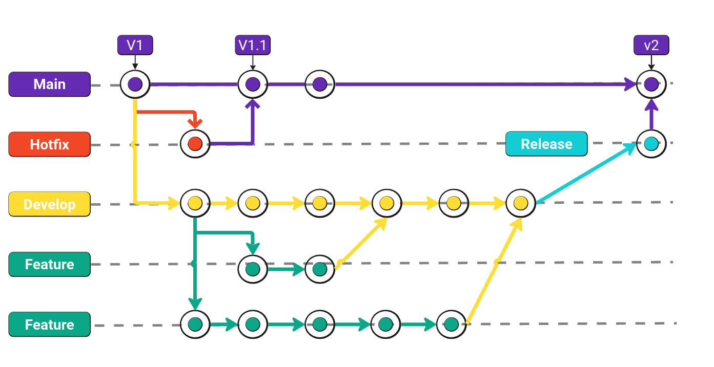

# Git Flow
Este guia visa explicar o fluxo de trabalho do Git Flow, uma metodologia de desenvolvimento de software que tem como objetivo facilitar a organização e a entrega de novas funcionalidades. Este guia destina-se a usuários que já possuem algum conhecimento básico sobre Git(Branches, Commits, Mesclagens, etc.) e desejam aprofundar seus conhecimentos sobre o Git Flow. Se você é iniciante no Git, recomendamos que leia o guia [Git - Guia Prático](#) (TODO)

## O que é Git Flow?
O Git Flow é um modelo de ramificação para o Git, criado por Vincent Driessen. O modelo é composto por cinco tipos de branches, cada um com um propósito específico. O Git Flow é baseado no conceito de Feature Branching, que consiste em criar uma nova branch para cada nova funcionalidade a ser desenvolvida. Isso permite que várias funcionalidades sejam desenvolvidas simultaneamente, sem interferir no código principal.
As cinco branches principais do Git Flow são:
- **Main**: branch principal do projeto, contendo apenas código estável e pronto para produção.
- **HOTFIX**: branch para correção de bugs críticos em produção. As correções são feitas diretamente nesta branch e depois mescladas de volta para a branch Main.
- **Develop**: branch de desenvolvimento, onde são feitas as integrações de novas funcionalidades. Cada nova funcionalidade é desenvolvida em uma branch separada e depois mesclada na branch Develop. 
- **Feature**: branch para desenvolvimento de novas funcionalidades. Cada nova funcionalidade é desenvolvida em uma branch separada e depois mesclada na branch Develop.
- **Release**: branch para preparar uma nova versão do software. Nesta branch são feitos testes finais e ajustes antes de serem mesclados na branch Main. Se após os testes forem encontrados bugs, eles são corrigidos na branch Release e depois mesclados de volta para a branch Main.

## Fluxo de trabalho
O fluxo de trabalho do Git Flow é baseado na criação de branches para cada tipo de atividade. O fluxo de trabalho típico é o seguinte:
1. Criar uma nova branch Feature a partir da branch Develop.    
2. Desenvolver a nova funcionalidade na branch Feature. 
3. Mesclar a branch Feature de volta para a branch Develop.
4. Criar uma nova branch Release a partir da branch Develop.
5. Realizar testes finais e ajustes na branch Release.
6. Mesclar a branch Release de volta para a branch Main.

Vale ressaltar que os passos acima é um simplista, pois nos projetos reais multiplas pessoas estão trabalhando simultaneamente em diferentes funcionalidades. Por isso, é importante manter a branch Develop sempre atualizada com as últimas alterações. Para uma visão mais detalhada do fluxo de trabalho do Git Flow, considere o seguinte diagrama:

O diagrama acima mostra o seguinte cenário: 
- O código começa na branch Main, que contém a versão estável do software, V1.
- Algum bug crítico é encontrado em produção, então é criada uma branch HOTFIX para corrigir o bug.
- Enquanto o bug é corrigido, duas novas funcionalidades passam a ser desenvolvidas nas branchs Features. Veja que no momento da criação da branch Develop, ela contém a versão V1 do software, que possui o bug crítico.
- Após a correção do bug, a branch HOTFIX é mesclada de volta para a branch Main. Assim, a versão V1.1 do software é lançada.
- Tempos depois, a primeira funcionalidade é finalizada e mesclada de volta para a branch Develop.
- Um pouco depois, a segunda funcionalidade é finalizada e mesclada de volta para a branch Develop.
- Por fim, é criada uma branch Release para preparar a versão V2 do software. Nesta branch são feitos testes finais e ajustes antes de serem mesclados na branch Main.
- Após os testes finais, a branch Release é mesclada de volta para a branch Main. Assim, a versão V2 do software é lançada.

## Prós e contras
O Git Flow é uma metodologia de desenvolvimento de software muito popular, mas não é a única. Existem outras metodologias, como o Trunk Based Development. O Git Flow possui vantagens e desvantagens, que devem ser consideradas antes de adotá-lo em um projeto. Alguns dos prós e contras do Git Flow são:
### Prós
- Organização: o Git Flow organiza o desenvolvimento de software em etapas bem definidas, facilitando a colaboração entre os membros da equipe.
- Controle de versão: o Git Flow permite controlar as versões do software de forma clara e organizada, facilitando a identificação de bugs e a criação de hotfixes.
- Flexibilidade: o Git Flow é flexível e pode ser adaptado de acordo com as necessidades do projeto.

### Contras
- Complexidade: o Git Flow pode ser complexo para projetos pequenos e equipes pequenas, pois envolve a criação de várias branches e etapas de desenvolvimento.
- Overhead: o Git Flow pode adicionar overhead ao processo de desenvolvimento, pois exige a criação de várias branches e mesclagens frequentes.

## Outras referencias, comandos e dicas
Enquanto desenvolvemos utilizando esta metodologia, acabamos por utilizar alguns comandos do git que são essenciais para o desenvolvimento. Além disso, é importante saber como lidar com situações de conflito e como resolver problemas comuns. Abaixo, listamos alguns comandos e dicas úteis para o desenvolvimento com o Git Flow:
### Comandos úteis
- `git branch`: lista todas as branches do repositório.
- `git checkout -b <branch>`: cria uma nova branch e muda para ela.
- `git merge <branch>`: mescla uma branch na branch atual.
- `git rebase <branch>`: reaplica as alterações da branch atual sobre a branch especificada.

Uma dica importante é manter a branch Develop sempre atualizada com as últimas alterações da branch Main. Isso pode ser feito utilizando o comando `git rebase Main` na branch Develop. Isso garante que a branch Develop esteja sempre atualizada com as últimas alterações e evita conflitos na hora de mesclar as branches Feature e Release.

Para mais detalhes sobre os comandos do Git, consulte a documentação oficial do Git: [Git - Documentação](https://git-scm.com/doc).

Além disso, para uma referencia mais detalhada, o clássico [Git Flow Cheat Sheet](https://danielkummer.github.io/git-flow-cheatsheet/index.pt_BR.html) é uma ótima fonte de informação sobre os comandos e etapas do Git Flow. Este guia também apresenta uma ferramenta chamada `git-flow`, que automatiza o processo de criação de branches e mesclagens, facilitando o desenvolvimento com o Git Flow.

## Conclusão
O gitflow é uma metodologia de desenvolvimento escalável para projetos grandes e flexível, ao custo de uma complexidade maior. Muitas vezes, em projetos pequenos, decidimos simplificar este processo, removendo algumas etapas que não são necessárias. O importante é entender o conceito por trás do gitflow e adaptá-lo de acordo com as necessidades do projeto. Outras abordagens como o Trunk Based Development podem ser mais diretas e eficientes para projetos menores. Além disso, a escolha da estratégia também depende da experiência da equipe: Se o time já está acostumado com o projeto a ser desenvolvido, então eles tem maturidade o suficiente para escolher uma estratégia mais direta e eficiente.

## Referências
- [Git - Documentação](https://git-scm.com/doc)
- [Git Flow Cheat Sheet](https://danielkummer.github.io/git-flow-cheatsheet/index.pt_BR.html)
- [Trunk Based Development](https://trunkbaseddevelopment.com/)
- [Vincent Driessen - A successful Git branching model](https://nvie.com/posts/a-successful-git-branching-model/)
- [Ferramenta git-flow](https://github.com/nvie/gitflow)